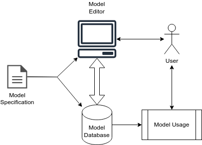

# Tool Generator

This directory contains the logic to process a model specification and from that generate both the client and
the server side code for a diagram editing tool: the two left-most arrows in the overview below.

Code is generated from templates, using the Mako [^1] templating framework.

* *generate_tool.py*: Script that accepts a model specification and generates the tool. Also some code that
  collects data from the model specification that is used by the code generating templates.
* *model_definition.py*: the library on which model specification files depend. Uses Python decorators to collect
  and organise the model details.
* *run_project.py*: Script that looks for a model specification in a specific directory, generates the code, dependencies,
  and runs the server. Code generation is very fast, so this is done everything the script is run.
* *templates*: Directory that contains 4 templates that generate the code. There are templates to generate:
  * The server data_model
  * The server main module
  * The client main HTML file
  * The client data model + main code.

The generated server depends on SQLAlchemy, Flask and python-magic [^2]. The generated client depends on Brython and Bootstrap [^3].

[^1]: https://www.makotemplates.org/ v1.2.4.
[^2]: https://www.sqlalchemy.org/ v2.0.23, https://flask.palletsprojects.com v3.0.0, https://pypi.org/project/python-magic/ v0.4.27
[^3]: https://brython.info v3.12.3 and https://getbootstrap.com/ v4.6.0