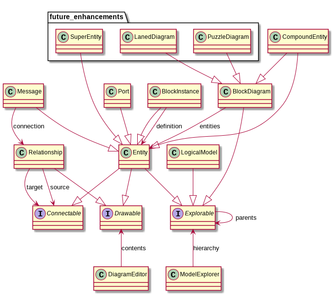

# Syntax

Currently, the model specification is written using regular Python syntax.
The model_definition module provides the `ModelDefinition` class, which contains a number of "decorators"
that are to be used to define the model. For example, to define a simple block, the following code can be used:

```python
@md.Entity(styling = "shape:rect;structure:Block;icon:square-full", parents=[Self, StructuralModel])
class Block:
    name: str
    description: longstr
```

This snippet contains a lot of different bits of information:

* Information used for *rendering* the block in both diagrams and the explorer list, in the `styling` field.
* The `parents` field specifies of which entities it can be a child. 
  This means "Block" is available in the right-click context menu of its parents in the explorer.
* Additional attributes `name` and `description` are defined, which can be used to either better understand the model, or for use when
  the model is used as an Domain Specific Language. DSLs are always processed to achieve some purpose.

# Elements of a specification

The model specification (and this document) uses the following terminology:

* *LogicalModel*: These elements show up only in the navigator, it is not possible to place these in any diagrams.
  Examples are folders for organising different sections of the model.
* *Entity*: the main elements of a diagram. In a block diagram, these are blocks.
* *Relationship*: the connections between blocks in a block diagram.
* *Port*: can be added to specific blocks as specific connection points.
* *BlockDiagram*: element that only shows up in the navigator, but double-clicking it opens a diagram in the diagram editor.

There are also two special elements:
* *CompoundEntity*: Both a block and a diagram. Can be used to recursively elaborate models.
* *BlockInstance*: A block that instantiates another block defined elsewhere. Used to e.g. use blocks defined in a library.
  These blocks are created automatically when an existing block is dragged-and-dropped into a diagram, but that diagram
  does not receive blocks of that type -- but does receive Instances of that block.
  In possible relationships, a distinction is made between Instances and their definition.
  Also useful in UML diagrams where instances of classes are used, like the communication and sequence diagrams.

Several other elements are planned for future addition:
* *Message*: can be associated with a relationship, needed for the UML Communication (Collaboration) Diagram.
* *LanedDiagram*: needed for UML Sequence Diagrams.
* *PuzzleDiagram*: needed for Scratch-like models & Nassi-Shneiderman diagrams, where blocks slot into each other.
* *SuperEntity*: Similar to the CompoundEntity, but the block is a border around its contents. It is not a separate
  diagram in itself. An example is the UML Model Diagram.

## Constraints
In the definition of these elements, their constraints are also set.
These constraints are then objected by the client that edits the model, so the logical rules that are set in the
specification will automatically be obeyed.

The following constraints are used:
* Each Relationship has a specific list of Entities and Ports that can be used as *source* or *target*. This constraint
  is evaluated when a connection between two elements is made. If multiple types of relationships can be made
  between the two elements, the user is presented with a list to choose from.
* Each Diagram has a list of Entities that can be instantiated in it. From the 
* Each Port has a list of Entities that it can be attacked to. When editing ports, if several types of ports
  can be attached to an Entity, the user is required to choose between them.
* Each type of port that can be attached to a CompountEntity is shown in its diagram as if they were Entities.
* Each element that is represented in the navigator can optionally have a list of elements that can be its parent.
  This is used to fill the right-click menu with which new elements can be created in the navigator.

## Overview

In the Class diagram below an overview is given of how the different elements of the modeling language relate to each other.
These are conceptual only, nowhere in the software will you find an implementation of these classes.
The code generation builds separate classes that satisfy the necessary interfaces.
Also, the `parents` and `entities` constraints are only used at code-generation time, not at run-time.




Some notable details:
* A Port is just a regular Entity. The only difference between the two is how they are rendered in a diagram.
  Same for a Message.
* Relationships are not explorable. This may change in the future. 
  In most UML tools, relationships *are* explorable, but I find that illogical.
  Is a relationship represented with the source? The target? Both?
  For example, in the explorer you would want to browse from source to target etc.
  Perhaps a specific relationship explorer should be made, or a way to navigate from block to connected blocks.

